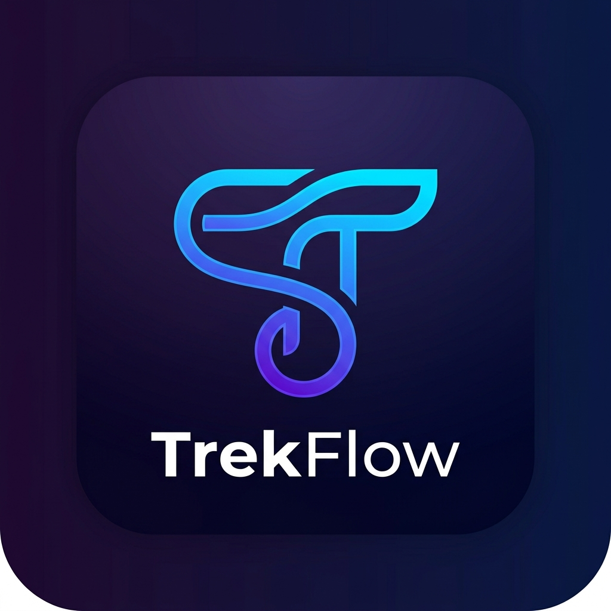
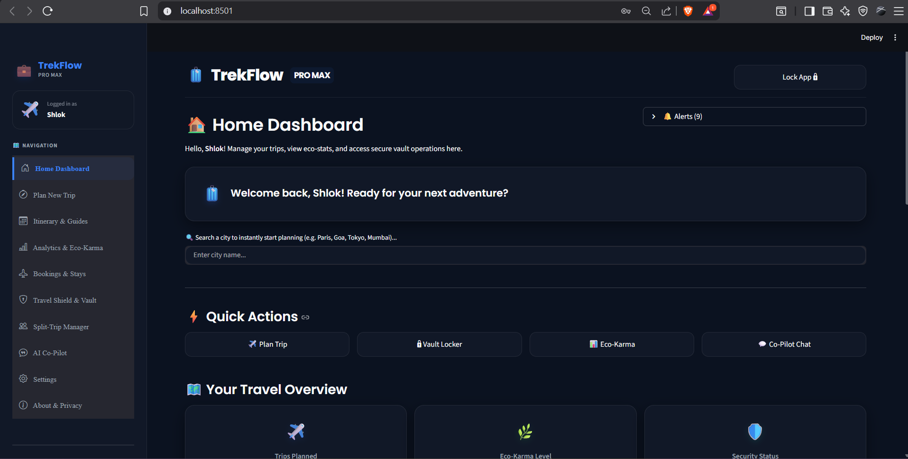
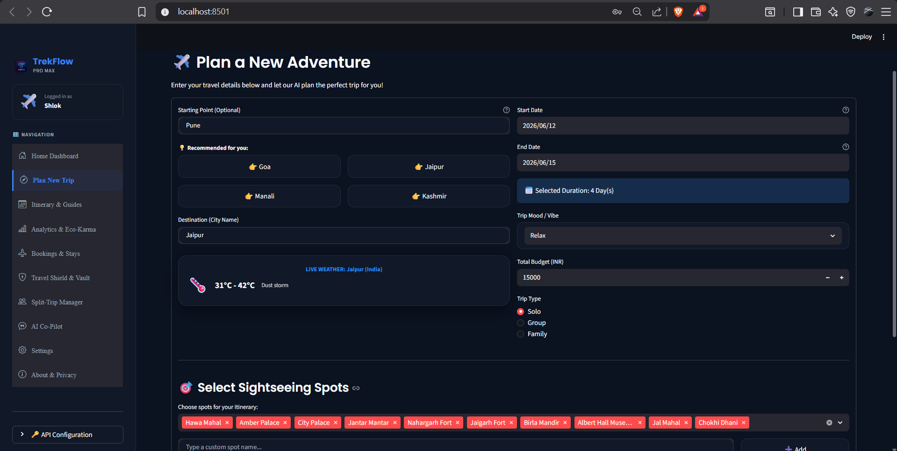
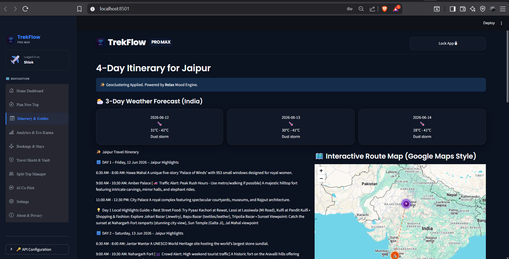
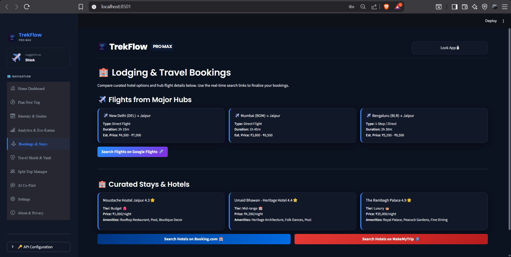

<p align="center">
  
</p>

<h1 align="center">🎒 TrekFlow</h1>
<p align="center"><strong>AI-Powered Travel Co-Pilot & Journey Manager</strong></p>

<p align="center">
  <em>An advanced, premium travel assistant that creates date-aware itineraries, monitors dynamic budgets, calculates group splits, manages secure document lockers, and triggers real-time situational alerts.</em>
</p>

<p align="center">
  <a href="https://trekflow.streamlit.app/" target="_blank">
    
  </a>
</p>

<p align="center">
  
  
  
  
  
</p>

<p align="center">
  🚀 <a href="https://trekflow.streamlit.app/"><strong>Live App Demo</strong></a> • 
  ⚡ <a href="#-setup--installation">Quick Install</a> • 
  📖 <a href="#-project-structure">Project Architecture</a> • 
  📺 <a href="#-project-demo-video">Demo Video</a> • 
  🤝 <a href="#-contributing">Contribute</a>
</p>

---

### 🎯 Key Features at a Glance

| 🤖 AI Co-Pilot | 💰 Smart Budgeting | 🔒 Encrypted Vault | 🚨 Real-time Alerts |
| :---: | :---: | :---: | :---: |
| Multilingual planning with customizable travel vibes | Pro allocator splits & validates trip expenses | AES-256 secure locker for travel documents/IDs | Pop-ups for weather, security, and eco-milestones |

---

## 📋 Table of Contents

* 🎯 [Key Features at a Glance](#-key-features-at-a-glance)
* ✨ [Core Capabilities](#-core-capabilities)
* 📸 [Screenshots & Previews](#-screenshots--previews)
* 🛠️ [Technology Stack](#%EF%B8%8F-technology-stack)
* 📂 [Project Structure](#-project-structure)
* ⚙️ [Setup & Installation](#%EF%B8%8F-setup--installation)
* 🔒 [Security & Encryption](#-security--encryption)
* 📺 [Project Demo Video](#-project-demo-video)
* 🤝 [Contributing & Feedback](#-contributing--feedback)
* ⭐ [Show Your Support](#-show-your-support)
* 👤 [Author & Contact](#-author--contact)

---

## ✨ Core Capabilities

| Feature | Details |
| :--- | :--- |
| **AI Itinerary Engine** | Generates dynamic day-wise schedules that automatically skip monument closure days, highlight traffic peak-hours, and fetch local sunset points. |
| **Pro Budget Allocator** | Validates your budget and generates clean breakdown visualizations for Food, Stays, Transport, Shopping, and Sightseeing. |
| **Split-Trip Ledger** | Shared group expense calculator that maps settlements and clarifies debt resolution. |
| **Multilingual Engine** | Dynamic translation registry supporting English, Hindi, Spanish, French, German, Italian, Japanese, and Russian. |
| **Situational Alerting** | Simulates and logs warnings regarding weather changes, local transit disruption, and custom eco-karma benchmarks. |
| **Vault / Shield** | Secure database authentication coupled with cryptographic locker storage for personal safety documents. |

---

## 📸 Screenshots & Previews

<p align="center">
  <strong>🖥️ Home Dashboard</strong><br/>
  
</p>

<br/>

<p align="center">
  <strong>✈️ Plan a New Adventure</strong><br/>
  
</p>

<br/>

<p align="center">
  <strong>🗺️ Day-wise Itinerary & Interactive Route Map</strong><br/>
  
</p>

<br/>

<p align="center">
  <strong>🏨 Lodging & Travel Bookings</strong><br/>
  
</p>

<br/>

<p align="center">
  <strong>📄 Exported PDF Travel Itinerary Guide</strong><br/>
  📂 <a href="assets/sample_itinerary.pdf"><strong>Download / View Sample Itinerary (PDF)</strong></a>
</p>

---

## 🛠️ Technology Stack

* **Frontend Framework**: [Streamlit](https://streamlit.io/) (featuring a premium Dark/Light Glassmorphism design system)
* **AI Orchestration**: [LangChain](https://www.langchain.com/), LangChain-Groq, Groq APIs
* **Database**: SQLite3 (for secure, offline user profiles, expense logs, and notifications)
* **PDF Engine**: ReportLab (for exporting customized A4 printable itineraries with mobile sync QR codes)
* **Core Libraries**: Pillow (image utilities), qrcode (mobile data sharing), python-dotenv

---

## 📂 Project Structure

```text
TrekFlow/
├── app.py                   # Main entry point for Streamlit application and layout routing
├── pdf_generate.py          # Custom A4 PDF itinerary constructor with QR sync integration
├── requirements.txt         # Project runtime dependencies
├── .gitignore               # Configured to ignore environment files, databases, and logs
├── README.md                # System documentation
└── src/                     # Modular source code
    ├── auth/                # Security authentication manager and AES encryption
    │   ├── auth_manager.py
    │   └── encryption.py
    ├── budget/              # Budget allocation logic and expense validations
    │   ├── allocator.py
    │   └── feasibility.py
    ├── chains/              # AI LangChain suggestors and assistant runtimes
    │   ├── ai_suggester.py
    │   └── chat_assistant.py
    ├── core/                # Core assistant elements (Moods, alerts, packaging guidelines)
    │   ├── fallback_data.py
    │   ├── itinerary_chain.py
    │   ├── mood_engine.py
    │   ├── packing_assistant.py
    │   ├── planner.py
    │   ├── smart_alerts.py
    │   └── sustainability.py
    ├── database/            # SQLite interface managers (notifications, trips, group splits)
    │   ├── db.py
    │   ├── document_locker.py
    │   ├── notifications_manager.py
    │   ├── split_trip.py
    │   └── trips_manager.py
    ├── safety/              # Location-based emergency contacts list
    │   └── emergency.py
    ├── transport/           # Travel route recommendations and booking helper
    │   ├── booking_links.py
    │   ├── micro_mobility.py
    │   └── travel_type.py
    ├── ui/                  # Map rendering configurations and sub-pages
    │   ├── auth_ui.py
    │   └── map_renderer.py
    └── weather/             # Weather API configurations
        └── weather_api.py
```

---

## ⚙️ Setup & Installation

### 1️⃣ Clone the Repository
```bash
git clone https://github.com/shlok926/TrekFlow.git
cd TrekFlow
```

### 2️⃣ Create and Activate Virtual Environment
```bash
# Windows
python -m venv env
env\Scripts\activate

# macOS/Linux
python3 -m venv env
source env/bin/activate
```

### 3️⃣ Install Dependencies
```bash
pip install -r requirements.txt
```

### 4️⃣ Setup Environment Variables
Create a `.env` file in the root directory and add your Groq API key:
```env
GROQ_API_KEY=your_groq_api_key_here
```

### 5️⃣ Run the Application
```bash
streamlit run app.py
```

---

## 🔒 Security & Encryption
* **Local Persistence**: Dynamic database files (`*.db`), generated PDFs, temporary files, and local logs are strictly locked inside `.gitignore` and never committed to GitHub.
* **Cryptographic Vault**: Files in the Travel Vault are encrypted locally using AES-256 algorithms.

---

## 📺 Project Demo Video

Watch the execution and walkthrough of the application:
👉 [TrekFlow Demo Video](https://drive.google.com/file/d/1APE-HorIK1KM5sN4h5OSQrYg2_auD6CN/view?usp=sharing)

---

## 🤝 Contributing & Feedback

Contributions, suggestions, and feedback are highly welcome!
* **Got suggestions or feature requests?** Feel free to open a new [Issue](https://github.com/shlok926/TrekFlow/issues) or share your ideas.
* **Want to contribute?** Feel free to fork this repository, make your changes, and submit a Pull Request.

---

## ⭐ Show Your Support

<p align="center">
  <strong>Love this tool? Help us grow:</strong>
</p>

```text
✨ Star the repository     (GitHub Star Button)
🐛 Report bugs             (GitHub Issues)
💡 Suggest features        (GitHub Discussions)
📢 Share with others       (LinkedIn/Twitter)
🤝 Contribute code         (Pull Requests)
```

---

## 👤 Author & Contact

<h3 align="center">👨‍💻 Shlok Thorat</h3>

<p align="center">
  <em>Let's connect on LinkedIn, collaborate, and build amazing things together!</em>
</p>

<p align="center">
  <a href="mailto:Shlokthorat29075@gmail.com" target="_blank">
    
  </a>
  <a href="https://github.com/shlok926" target="_blank">
    
  </a>
  <a href="https://www.linkedin.com/in/shlok-thorat-39916a405/" target="_blank">
    
  </a>
</p>

---

<p align="center">
  Made with ❤️ for travel enthusiasts • <a href="#-trekflow">Back to Top</a>
</p>
